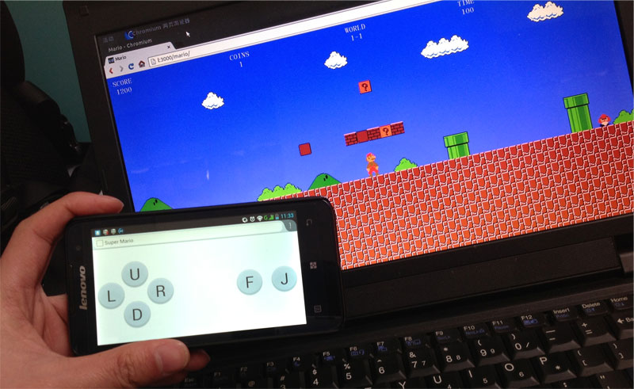

#game-controller

Inspired by [controldeck.js](https://github.com/dfcb/controldeck.js). With the same idea, this repo shows how to turn a mobile phone into a game controller.

Our first game is Super Mario which is written by [@Diogenesthecynic](https://github.com/Diogenesthecynic/) in javascript. 

### How to Play

1. First, make sure your have [node](http://nodejs.org/) installed, if not, follow the [installation guide](https://github.com/joyent/node/wiki/Installation).

2. Download this repo and install required packages.
        
        git clone git://github.com/yuanchuan/game-controller.git
        cd game-controller 
        npm install

3. Download games with submodule.

        git submodule init && git submodule update

4. Run the server.

        node app.js

5. Open your browser and have fun!

  - The game page: [http://localhost:3000/mario/index.html](http://localhost:3000/mario/) 
  - The controller page: [http://localhost:3000/mario/controller.html](http://localhost:3000/mario/controller.html)

### Screenshot

###License

[Creative Commons Attribution 3.0 License](http://creativecommons.org/licenses/by/3.0/)
